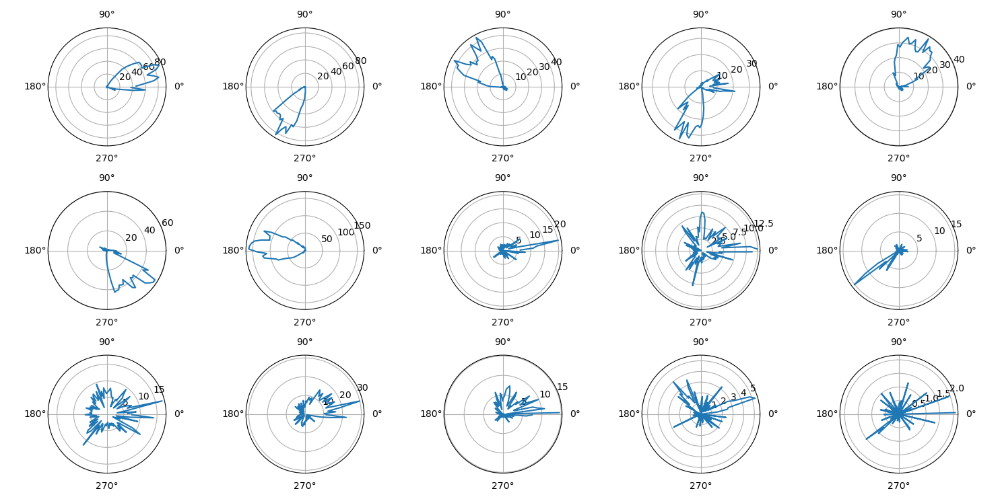

<!--  -->
<p align="center">
  
</p>


<!-- ========================== -->

[](https://pypi.python.org/pypi/pynapple)

[](https://github.com/PeyracheLab/pynapple/issues)


<!-- [](https://travis-ci.com/gviejo/pynapple) -->

PYthon Neural Analysis Package.

pynapple is a light-weight python library for neurophysiological data analysis. The goal is to offer a versatile set of tools to study typical data in the field, i.e. time series (spike times, behavioral events, etc.) and time intervals (trials, brain states, etc.). It also provides users with generic functions for neuroscience such as tuning curves and cross-correlograms.

-   Free software: GNU General Public License v3
-   __Documentation__: <https://peyrachelab.github.io/pynapple>
-   __Notebooks and tutorials__ : <https://peyrachelab.github.io/pynapple/notebooks/pynapple-quick-start/>
-   __Collaborative repository__: <https://github.com/PeyracheLab/pynacollada>
------------------------------------------------------------------------

Getting Started
---------------

### Installation

The best way to install pynapple is with pip within a new [conda](https://docs.conda.io/en/latest/) environment :

``` {.sourceCode .shell}
$ conda create --name pynapple pip
$ conda activate pynapple
$ pip install pynapple
```

or directly from the source code:

``` {.sourceCode .shell}
$ conda create --name pynapple pip
$ conda activate pynapple
$ # clone the repository
$ git clone https://github.com/PeyracheLab/pynapple.git
$ cd pynapple
$ # Install in editable mode with `-e` or, equivalently, `--editable`
$ pip install -e .
```

This procedure will install all the dependencies including 

-   pandas
-   numpy
-   scipy
-   numba
-   pynwb 2.0
-   tabulate
-   pyqt5
-   pyqtgraph
-   h5py

For spyder users, it is recommended to install spyder after installing pynapple with :

``` {.sourceCode .shell}
$ conda create --name pynapple pip
$ conda activate pynapple
$ pip install pynapple
$ pip install spyder
$ spyder
```


Basic Usage
-----------

After installation, the package can imported:

``` {.sourceCode .shell}
$ python
>>> import pynapple as nap
```

An example of the package can be seen below. The exemple data can be
found
[here](https://www.dropbox.com/s/su4oaje57g3kit9/A2929-200711.zip?dl=1). The folder already contains the NWB file (See this [notebook](https://github.com/PeyracheLab/pynapple/blob/main/docs/notebooks/pynapple-io-notebook.ipynb) for understanding the creation of the NWB file).

``` py
import numpy as np
import pandas as pd
import pynapple as nap
from matplotlib.pyplot import *

data_directory = '/your/path/to/A2929-200711'

# LOADING DATA
data = nap.load_session(data_directory, 'neurosuite')


spikes = data.spikes
position = data.position
wake_ep = data.epochs['wake']

# COMPUTING TUNING CURVES
tuning_curves = nap.compute_1d_tuning_curves(group = spikes, 
                                            feature = position['ry'], 
                                            ep = position['ry'].time_support, 
                                            nb_bins = 120,  
                                            minmax=(0, 2*np.pi) )
                                                

        
# PLOT
figure()
for i in spikes:
    subplot(6,7,i+1, projection = 'polar')
    plot(tuning_curves[i])
    

show()

```
Shown below, the final figure from the example code displays the firing rate of 15 neurons as a function of the direction of the head of the animal in the horizontal plane.

<!--  -->
<p align="center">
  
</p>


### Credits

Special thanks to Francesco P. Battaglia
(<https://github.com/fpbattaglia>) for the development of the original
*TSToolbox* (<https://github.com/PeyracheLab/TStoolbox>) and
*neuroseries* (<https://github.com/NeuroNetMem/neuroseries>) packages,
the latter constituting the core of *pynapple*.

This package was developped by Guillaume Viejo
(<https://github.com/gviejo>) and other members of the Peyrache Lab.

Logo: Sofia Skromne Carrasco, 2021.
